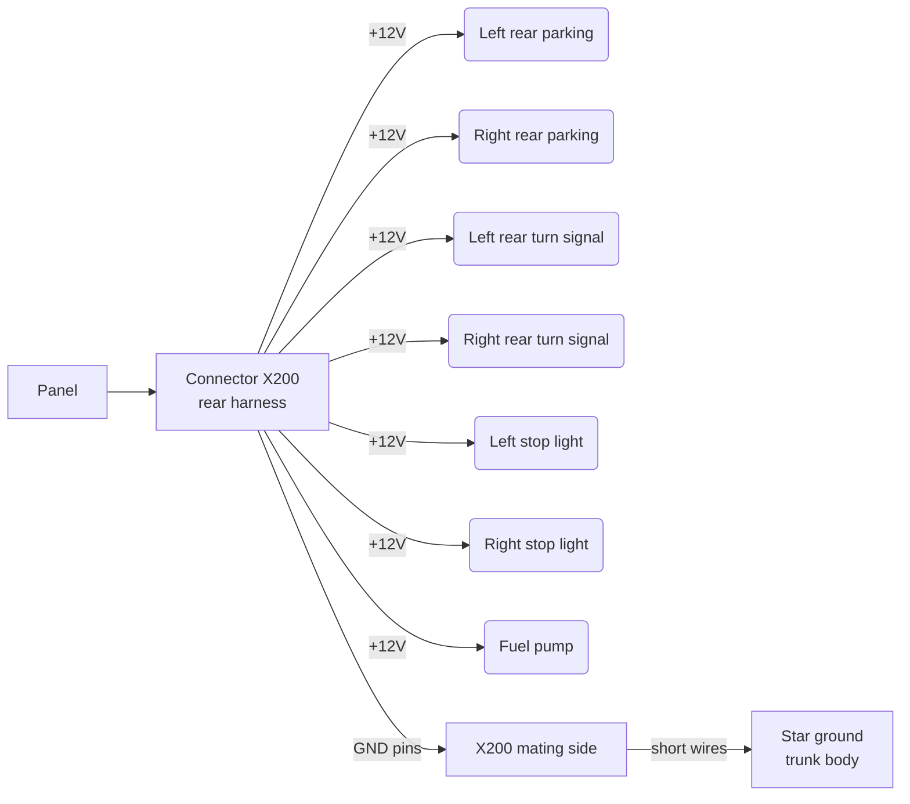

# Rear Harness

## 1. Purpose and Routing

The rear harness supplies power to the tail lights (parking, turn signals, stop lights) and the fuel pump. It exits the central panel along the left sill to the trunk, reaching the tail light assemblies and fuel pump. Routing — along the left sill and floor pan to the rear body sections.

**Local Ground concept:** from MICTUNING to the harness, only +12V wires run. Ground wires are not routed through the harness back to the panel. Connector X200 has dedicated GND pins — one per consumer. On the mating side of the connector, each GND pin connects with a short wire (200–400 mm) to the nearest body ground point in the trunk. Body ground points are tied together in a star topology.

## 2. Connector X200 — Pinout

Connector X200 is 16-pin. It contains 7 power (+12V) and 7 individual GND pins, one per consumer. GND pins are grounded to the body on the mating side of the connector via short wires to the nearest ground points.

| Pin | Signal | Destination | Gauge (mm²) | Note |
|-----|--------|-------------|-------------|------|
| 1 | +12V (MICT CH10) | Left rear parking (+) | 0.75 | |
| 2 | +12V (MICT CH10) | Right rear parking (+) | 0.75 | |
| 3 | +12V (MICT CH11) | Left rear turn signal (+) | 0.75 | Flash |
| 4 | +12V (MICT CH12) | Right rear turn signal (+) | 0.75 | Flash |
| 5 | +12V (Stop Pedal → s-6) | Left stop light (+) | 1.0 | From Stop Pedal via splice s-6 |
| 6 | +12V (Stop Pedal → s-6) | Right stop light (+) | 1.0 | From Stop Pedal via splice s-6 |
| 7 | +12V (MICT CH3) | Fuel pump (+) | 2.5 | Direct power from PDM |
| 8 | GND parking left | → body ground point | 0.75 | Left parking |
| 9 | GND parking right | → body ground point | 0.75 | Right parking |
| 10 | GND turn left | → body ground point | 0.75 | Left turn signal |
| 11 | GND turn right | → body ground point | 0.75 | Right turn signal |
| 12 | GND stop left | → body ground point | 1.0 | Left stop light |
| 13 | GND stop right | → body ground point | 1.0 | Right stop light |
| 14 | GND fuel pump | → body ground point | 2.5 | Fuel pump |
| 15 | NC | – | – | Reserve |
| 16 | NC | – | – | Reserve |

**Principle:** each consumer (left/right) gets a separate +12V wire and a separate GND pin — as in the front harness (X100). GND pin gauge equals the gauge of the corresponding + wire for the same consumer.

## 3. Rear Harness Circuit Table

### Power Circuits

| ID | From | To | Length (mm) | Gauge (mm²) | Color | Fuse | MICT Channel | Note |
|----|------|----|-------------|-------------|-------|------|-------------|------|
| P13 | Panel CH10 (PARK) | Left rear parking (+) | ≈ TBD | 0.75 | White | 15A | CH10 | Left rear parking |
| P14 | Panel CH10 (PARK) | Right rear parking (+) | ≈ TBD | 0.75 | Light Blue | 15A | CH10 | Right rear parking |
| P15 | Panel CH11 (L TURN) | Left rear turn signal (+) | ≈ TBD | 0.75 | Yellow | 10A | CH11 | Left turn (Flash) |
| P16 | Panel CH12 (R TURN) | Right rear turn signal (+) | ≈ TBD | 0.75 | Green | 10A | CH12 | Right turn (Flash) |
| P17 | Stop Pedal.Out → splice s-6 | Left stop light (+) | ≈ TBD | 1.0 | Violet | — | — | From Stop Pedal via splice s-6 |
| P17a | Stop Pedal.Out → splice s-6 | Right stop light (+) | ≈ TBD | 1.0 | Violet | — | — | From Stop Pedal via splice s-6 |
| P18 | Panel CH3 (FUEL) | Fuel pump (+) | ≈ TBD | 2.5 | Red | 20A | CH3 | Direct power from PDM |

### Ground Circuits

Ground wires do not run through the rear harness. Connector X200 has dedicated GND pins — one per consumer (left/right separate). On the mating side of the connector, each GND pin connects with a short wire to the nearest body ground point in the trunk. Body ground points are tied together in a star topology.

| ID | From | To | Length (mm) | Gauge (mm²) | Color | Note |
|----|------|----|-------------|-------------|-------|------|
| P23 | X200 pin 8 (GND parking L) | Body ground point | ≈ 200–400 | 0.75 | Black | Left parking |
| P23a | X200 pin 9 (GND parking R) | Body ground point | ≈ 200–400 | 0.75 | Black | Right parking |
| P24 | X200 pin 10 (GND turn L) | Body ground point | ≈ 200–400 | 0.75 | Black | Left turn signal |
| P25 | X200 pin 11 (GND turn R) | Body ground point | ≈ 200–400 | 0.75 | Black | Right turn signal |
| P26 | X200 pin 12 (GND stop L) | Body ground point | ≈ 200–400 | 1.0 | Black | Left stop light |
| P26a | X200 pin 13 (GND stop R) | Body ground point | ≈ 200–400 | 1.0 | Black | Right stop light |
| P27 | X200 pin 14 (GND fuel pump) | Body ground point | ≈ 200–400 | 2.5 | Black | Fuel pump |

## 4. Connection Descriptions

### Rear Parking Lights

Rear parking lights (P13–P14) are powered in parallel from MICT channel CH10 (front + rear parking). Front parking lights run through the front harness (connector X100), rear parking lights through the rear harness (X200). Both pairs are fed from the same channel CH10.

### Turn Signals

Left rear (P15, CH11) and right rear (P16, CH12) turn signals are powered separately through the corresponding MICT channels in Flash mode. Front turn signals on the same side run through the front harness (X100), rear turn signals through the rear harness (X200). Each MICT channel (CH11/CH12) drives the front + rear turn signal on one side.

### Stop Lights

Stop lights (P17 + P17a) receive power from the stop pedal switch (Stop Pedal, C4), which is powered directly from the main bus+ (constant +12V). When the pedal is pressed, +12V passes through the switch → splice s-6 → X200.5 (left stop) and X200.6 (right stop). Each stop light has a separate wire from splice s-6. Stop lights work regardless of ignition state (safety). CH6 is a free reserve channel.

### Fuel Pump

Pump power (P18) is supplied directly from MICT channel CH3 (20A, Toggle). MICTUNING is a PDM — each channel delivers power directly to the load. No external relay is needed for the fuel pump: CH3 provides up to 20A, which covers the draw of an upgraded aftermarket pump (~10–15A).

## 5. Wire Gauges and Rationale

| Consumer | Gauge (mm²) | Rationale |
|----------|-------------|-----------|
| Rear parking lights | 0.75 | 5W bulbs, current < 1A |
| Rear turn signals | 0.75 | 21W bulbs, current ~1.7A |
| Stop lights (each) | 1.0 | 21W bulb, current ~1.7A, margin for run length |
| Fuel pump | 2.5 | Up to 15A (aftermarket pump), long run to trunk |
| GND pins (each) | = + wire gauge | GND gauge = gauge of the corresponding + wire for the same consumer |

## 6. Boundary with Front Harness

| Circuit | Front Harness (X100) | Rear Harness (X200) |
|---------|----------------------|---------------------|
| Parking (CH10) | Front parking lights | Rear parking lights |
| Left turn signal (CH11) | Front left | Rear left |
| Right turn signal (CH12) | Front right | Rear right |
| Stop lights (Stop Pedal) | — | Rear stop lights (L+R separate, via splice s-6) |
| Fuel pump (CH3) | — | Fuel pump |

Both harnesses receive power from the central panel. Channels CH10/CH11/CH12 split at the panel: one branch goes to the front harness, the other to the rear.
