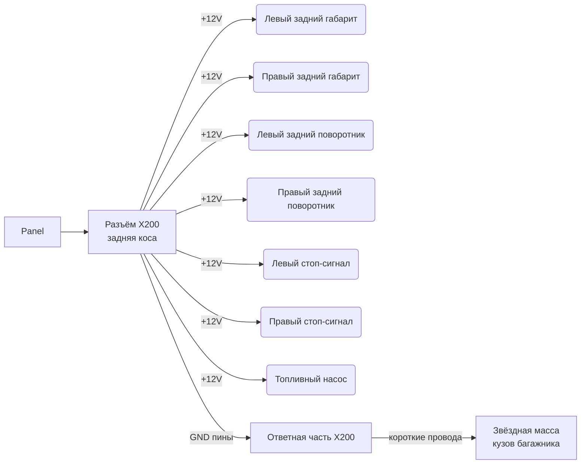

# Задняя коса (Rear Harness)

## 1. Назначение и маршрут прокладки

Задняя коса обеспечивает питание задних фонарей (габариты, поворотники, стоп-сигналы) и топливного насоса. Выходит из центральной панели по левому порогу в багажник к фонарям и бензонасосу. Прокладка — вдоль левого порога и днища до задних секций кузова.

**Концепция локальной массы:** от MICTUNING в косу идут только +12V провода. Минусовые провода не тянутся через жгут обратно к панели. В разъёме X200 помимо + пинов заведены выделенные GND-пины — по одному на каждого потребителя. В ответной части разъёма каждый GND-пин соединяется коротким проводом (200–400 мм) с ближайшей точкой массы на кузове в багажнике. Точки массы на кузове объединены по звёздной топологии.

## 2. Разъём X200 — распиновка

Разъём X200 — 16-пиновый. Содержит 7 силовых (+12V) и 7 индивидуальных GND-пинов, по одному на каждого потребителя. GND-пины замыкаются на кузов в ответной части разъёма короткими проводами к ближайшим точкам массы.

| Pin | Сигнал | Куда идёт | Сечение (мм²) | Примечание |
|-----|--------|-----------|----------------|------------|
| 1 | +12 В (MICT CH10) | Левый задний габарит (+) | 0.75 | |
| 2 | +12 В (MICT CH10) | Правый задний габарит (+) | 0.75 | |
| 3 | +12 В (MICT CH11) | Левый задний поворотник (+) | 0.75 | Flash |
| 4 | +12 В (MICT CH12) | Правый задний поворотник (+) | 0.75 | Flash |
| 5 | +12 В (Stop Pedal → s-6) | Левый стоп-сигнал (+) | 1.0 | От Stop Pedal через splice s-6 |
| 6 | +12 В (Stop Pedal → s-6) | Правый стоп-сигнал (+) | 1.0 | От Stop Pedal через splice s-6 |
| 7 | +12 В (MICT CH3) | Топливный насос (+) | 2.5 | Прямое питание от PDM |
| 8 | GND габарит левый | → точка массы кузова | 0.75 | Левый габарит |
| 9 | GND габарит правый | → точка массы кузова | 0.75 | Правый габарит |
| 10 | GND поворот. левый | → точка массы кузова | 0.75 | Левый поворотник |
| 11 | GND поворот. правый | → точка массы кузова | 0.75 | Правый поворотник |
| 12 | GND стоп левый | → точка массы кузова | 1.0 | Левый стоп-сигнал |
| 13 | GND стоп правый | → точка массы кузова | 1.0 | Правый стоп-сигнал |
| 14 | GND бензонасос | → точка массы кузова | 2.5 | Топливный насос |
| 15 | NC | – | – | Резерв |
| 16 | NC | – | – | Резерв |

**Принцип:** каждый потребитель (левый/правый) получает отдельный +12V провод и отдельный GND-пин — как в передней косе (X100). Сечение GND-пина равно сечению соответствующего + провода того же потребителя.

## 3. Таблица цепей задней косы

### Цепи питания

| ID | Откуда | Куда | Длина (мм) | Сечение (мм²) | Цвет | Пред. | Канал MICT | Примечание |
|----|--------|------|------------|----------------|------|-------|------------|------------|
| P13 | Panel CH10 (PARK) | Левый задний габарит (+) | ≈ неуточн. | 0.75 | белый | 15A | CH10 | Габарит левый задний |
| P14 | Panel CH10 (PARK) | Правый задний габарит (+) | ≈ неуточн. | 0.75 | голуб. | 15A | CH10 | Габарит правый задний |
| P15 | Panel CH11 (L TURN) | Левый задний поворотник (+) | ≈ неуточн. | 0.75 | жёлтый | 10A | CH11 | Поворотник левый (Flash) |
| P16 | Panel CH12 (R TURN) | Правый задний поворотник (+) | ≈ неуточн. | 0.75 | зелёный | 10A | CH12 | Поворотник правый (Flash) |
| P17 | Stop Pedal.Out → splice s-6 | Левый стоп-сигнал (+) | ≈ неуточн. | 1.0 | фиолет. | — | — | От Stop Pedal через splice s-6 |
| P17a | Stop Pedal.Out → splice s-6 | Правый стоп-сигнал (+) | ≈ неуточн. | 1.0 | фиолет. | — | — | От Stop Pedal через splice s-6 |
| P18 | Panel CH3 (FUEL) | Бензонасос (+) | ≈ неуточн. | 2.5 | красн. | 20A | CH3 | Прямое питание от PDM |

### Цепи массы

Массовые провода не проходят через заднюю косу. В разъёме X200 выделены индивидуальные GND-пины — по одному на каждого потребителя (левый/правый отдельно). В ответной части разъёма каждый GND-пин соединяется коротким проводом с ближайшей точкой массы на кузове в багажнике. Точки массы на кузове объединены по звёздной топологии.

| ID | Откуда | Куда | Длина (мм) | Сечение (мм²) | Цвет | Примечание |
|----|--------|------|------------|----------------|------|------------|
| P23 | X200 pin 8 (GND габарит L) | Точка массы кузова | ≈ 200–400 | 0.75 | чёрн. | Левый габарит |
| P23a | X200 pin 9 (GND габарит R) | Точка массы кузова | ≈ 200–400 | 0.75 | чёрн. | Правый габарит |
| P24 | X200 pin 10 (GND поворот. L) | Точка массы кузова | ≈ 200–400 | 0.75 | чёрн. | Левый поворотник |
| P25 | X200 pin 11 (GND поворот. R) | Точка массы кузова | ≈ 200–400 | 0.75 | чёрн. | Правый поворотник |
| P26 | X200 pin 12 (GND стоп L) | Точка массы кузова | ≈ 200–400 | 1.0 | чёрн. | Левый стоп-сигнал |
| P26a | X200 pin 13 (GND стоп R) | Точка массы кузова | ≈ 200–400 | 1.0 | чёрн. | Правый стоп-сигнал |
| P27 | X200 pin 14 (GND бензонасос) | Точка массы кузова | ≈ 200–400 | 2.5 | чёрн. | Топливный насос |

## 4. Описание подключений

### Задние габаритные огни

Задние габариты (P13–P14) питаются параллельно от канала CH10 MICT (габариты перед + зад). Передние габариты идут через переднюю косу (разъём X100), задние — через заднюю косу (X200). Обе пары запитаны от одного канала CH10.

### Поворотники

Левый задний (P15, CH11) и правый задний (P16, CH12) поворотники запитаны раздельно через соответствующие каналы MICT в режиме Flash. Передние поворотники той же стороны идут через переднюю косу (X100), задние — через заднюю (X200). Каждый канал MICT (CH11/CH12) питает передний + задний поворотник одной стороны.

### Стоп-сигналы

Стоп-сигналы (P17 + P17a) получают питание от выключателя стоп-сигнала (Stop Pedal, C4), который запитан напрямую от главной шины + (постоянное +12V). При нажатии педали +12V проходит через выключатель → splice s-6 → X200.5 (левый стоп) и X200.6 (правый стоп). Каждый стоп-сигнал — отдельный провод от splice s-6. Стоп-сигналы работают независимо от зажигания (безопасность). CH6 MICT — свободный резервный канал.

### Топливный насос

Питание насоса (P18) подаётся напрямую от канала CH3 MICT (20A, Toggle). MICTUNING — это PDM, каждый канал подаёт силовое питание напрямую на нагрузку. Никаких внешних реле для бензонасоса не требуется: CH3 обеспечивает до 20A, что покрывает потребление усиленного aftermarket насоса (~10–15A).

## 5. Сечения проводов и обоснование

| Потребитель | Сечение (мм²) | Обоснование |
|-------------|----------------|-------------|
| Задние габариты | 0.75 | Лампы 5W, ток < 1A |
| Задние поворотники | 0.75 | Лампы 21W, ток ~1.7A |
| Стоп-сигналы (каждый) | 1.0 | Лампа 21W, ток ~1.7A, запас по длине |
| Бензонасос | 2.5 | До 15A (aftermarket насос), длина трассы до багажника |
| GND-пины (каждый) | = сечение + провода | Сечение GND = сечение соответствующего + провода того же потребителя |

## 6. Границы ответственности с передней косой

| Цепь | Передняя коса (X100) | Задняя коса (X200) |
|------|----------------------|---------------------|
| Габариты (CH10) | Передние габариты | Задние габариты |
| Левый поворотник (CH11) | Передний левый | Задний левый |
| Правый поворотник (CH12) | Передний правый | Задний правый |
| Стоп-сигналы (Stop Pedal) | — | Задние стоп-сигналы (L+R раздельно, через splice s-6) |
| Бензонасос (CH3) | — | Топливный насос |

Оба жгута получают питание от центральной панели. Каналы CH10/CH11/CH12 разветвляются на панели: одна ветвь уходит в переднюю косу, другая — в заднюю.
